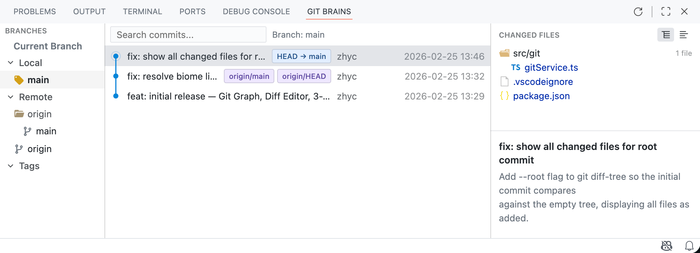
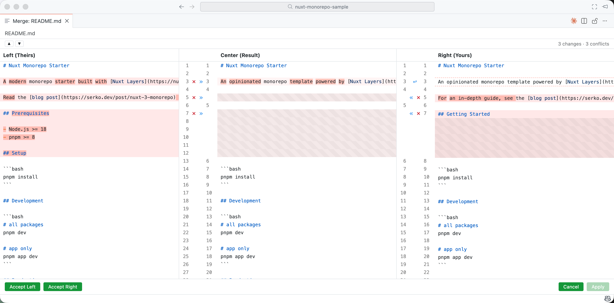
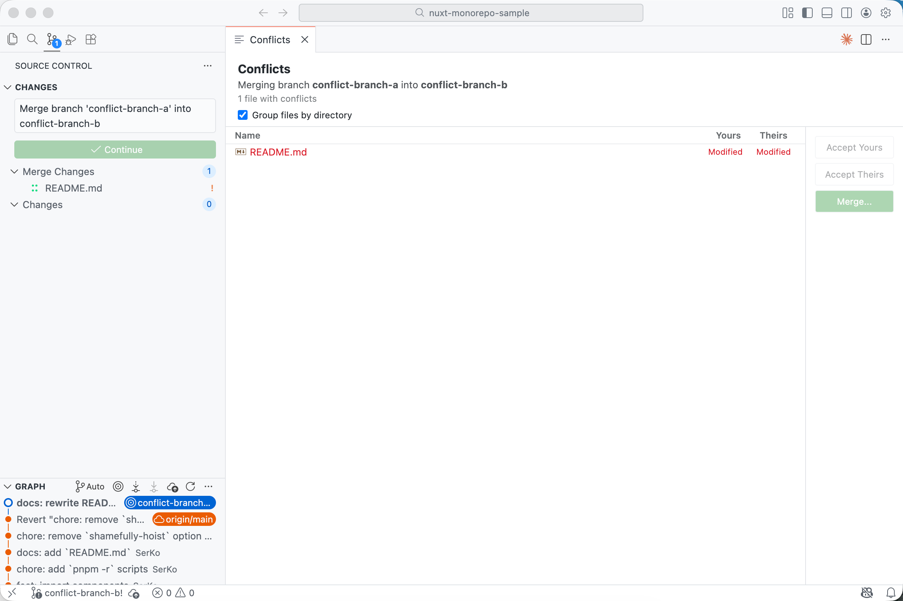

<a name="readme-top"></a>

<div align="center">

<h1>JetGit</h1>

JetBrains-style Git visualization for VS Code — Git Graph, Diff viewer, and 3-Way Merge Editor in one extension.

**English** · [简体中文](./README.zh_CN.md)

<!-- SHIELD GROUP -->

[![][github-license-shield]][github-license-link]

</div>

## Features

### Git Graph — Intuitive Commit History



- **Branch Tree** on the left: branches organized by Current Branch / Local / Remote / Tags for quick navigation
- **Commit List** in the center: color-coded branch lines connecting commits, with branch/tag labels (e.g. `HEAD → main`, `origin/main`), author, and timestamp
- **Detail Panel** on the right: full commit message and changed file list with directory grouping or flat view
- Search commits and filter by branch
- Click any changed file to open the **Diff Editor** with side-by-side code comparison

### 3-Way Merge Editor — Clear Three-Way Merging



- Three-column layout: **Left (Theirs)** | **Center (Result)** | **Right (Yours)**
- Conflict regions highlighted in red/green for instant visual distinction
- Per-block action buttons for quick conflict resolution
- Conflict statistics in the toolbar (e.g. "3 changes · 3 conflicts")
- Bottom action bar: **Accept Left** / **Accept Right** for bulk operations, **Cancel** / **Apply** to confirm
- Full syntax highlighting keeps code readable during merging

### Conflict List — Efficient Conflict Management



- Merge info banner (e.g. "Merging branch conflict-branch-a into conflict-branch-b")
- Conflict file list with Yours / Theirs modification status
- Group files by directory for organized viewing
- Quick actions per file: **Accept Yours** / **Accept Theirs** with one click, or **Merge...** to open the 3-Way Merge Editor
- Seamless integration with VS Code **Source Control** panel — conflict files visible directly in the Merge Changes section

## Installation

1. Search for **"JetGit"** in VS Code Extensions and click **Install**.
2. Or install from the [Visual Studio Code Marketplace](https://marketplace.visualstudio.com/items?itemName=zhycde.git-brains).

## Requirements

- VS Code 1.85.0 or later
- Git installed and available in your PATH
- Windows support is experimental

## Commands

| Command | Description | Access |
|---------|-------------|--------|
| JetGit: Refresh Git Log | Refresh the commit graph | Command Palette / Panel toolbar |
| JetGit: Conflicts | Open the conflict list | Command Palette / SCM toolbar |
| JetGit: Open Merge Editor | Open the merge editor | Command Palette |
| JetGit: Open in JetGit Merge Editor | Open merge editor from SCM | Right-click a conflict file |

## TODO

- [ ] Local Changes — changelists for managing uncommitted changes (similar to JetBrains)
- [ ] 3-Way Merge Editor: the Result column is read-only for now (editing support coming soon)
- [ ] Color theme adaptation in progress

## Local Development

```bash
git clone https://github.com/zhyc9de/git-brains.git
cd git-brains
pnpm install
cd webview && pnpm install && cd ..
```

Open the project in VS Code. Press **F5** to launch the Extension Development Host.

```bash
pnpm run watch       # Watch mode (extension + webview)
pnpm run build       # Full production build
```

## License

This project is [MIT](./LICENSE) licensed.

<!-- LINK GROUP -->

[github-license-link]: https://github.com/zhyc9de/git-brains/blob/main/LICENSE
[github-license-shield]: https://img.shields.io/github/license/user/git-brains?color=white&labelColor=black&style=flat-square
